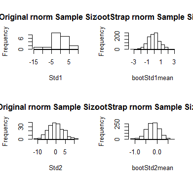
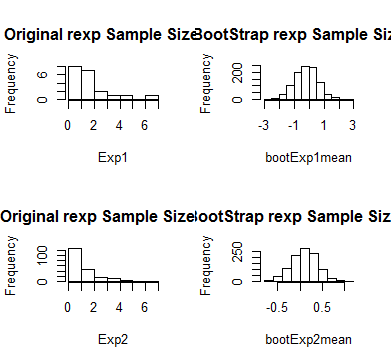

In this assignment, we were given the tasks to Write bootstrap code to illustrate the Central Limit Theorem in R
markdown and push result to GitHub.
"In probability theory, the central limit theorem (CLT) states that, given certain conditions, the arithmetic mean of a sufficiently large number of iterates of independent random variables, each with a well-defined expected value and well-defined variance, will be approximately normally distributed, regardless of the underlying distribution". CLTDefinitionSource".
In short, the CLT is saying that as our number of samples increases from any given population, the distribution of the averages of those samples will become closer to normally distributed. 
In this study, I have taken both Normal and exponential samples of size 20 and 200 to display this theorum in action. Each sample has gone through a bootstrap looping mechanism in order to replicate the random sampling of the original dataset. The means of each sample is then stored to be viewed in histograms. 

##Define two rnorm samples of differing sample sizes
Std1 <- rnorm(20, 0, 4)  #small sample size
Std2 <- rnorm(200, 0, 4) #large sample size

##Define two rexp samples of differing sample sizes
Exp1 <- rexp(20)  #small sample size
Exp2 <- rexp(200) #large sample size

##Define a vector to house the 1000 samples for each
bootStd1mean <- numeric(1000)
bootStd2mean <- numeric(1000)
bootExp1mean <- numeric(1000)
bootExp2mean <- numeric(1000)

##This is our bootstrap loop to define means of 1000 samples of our original dataset.
##Samples are chosen randomly with replacement
for (i in 1:1000) {
bootStd1 <- sample(Std1, size=length(Std1), replace=TRUE)
bootStd2 <- sample(Std2, size=length(Std2), replace=TRUE)

bootexp1 <- sample(Std1, size=length(Exp1), replace=TRUE)
bootexp2 <- sample(Std2, size=length(Exp2), replace=TRUE)

bootStd1mean[i] <- mean(bootStd1)
bootStd2mean[i] <- mean(bootStd2)

bootExp1mean[i] <- mean(bootexp1)
bootExp2mean[i] <- mean(bootexp2)
}
##Below you will see Histogram output from our results:

par(mfrow=c(2,2))
hist(Std1, main = "Original rnorm Sample Size 20")
hist(bootStd1mean, main = "BootStrap rnorm Sample Size 20")

hist(Std2, main = "Original rnorm Sample Size 200")
hist(bootStd2mean, main = "BootStrap rnorm Sample Size 200")

As you can see above, the original rnorm samples are slightly difficult to determine if the data is normally distributed. As we randomly sample these datasets 1000 times through a bootstrap mechanism, and take the average of these samples you see the distribution is easily identfied as normal.

##Below is the output of the same test on an exponentially distributed original dataset:

par(mfrow=c(2,2))
hist(Exp1, main = "Original rexp Sample Size 20")
hist(bootExp1mean, main = "BootStrap rexp Sample Size 20")

hist(Exp2, main = "Original rexp Sample Size 200")
hist(bootExp2mean, main = "BootStrap rexp Sample Size 200")

You see clearly that the original dataset is skewed, but when randomly samples through a bootstrap mechanisms - the distribution of averages becomes normally distributed.
I hope these results have helped you understand the Central Limit Theorum with some practical application and numbers

